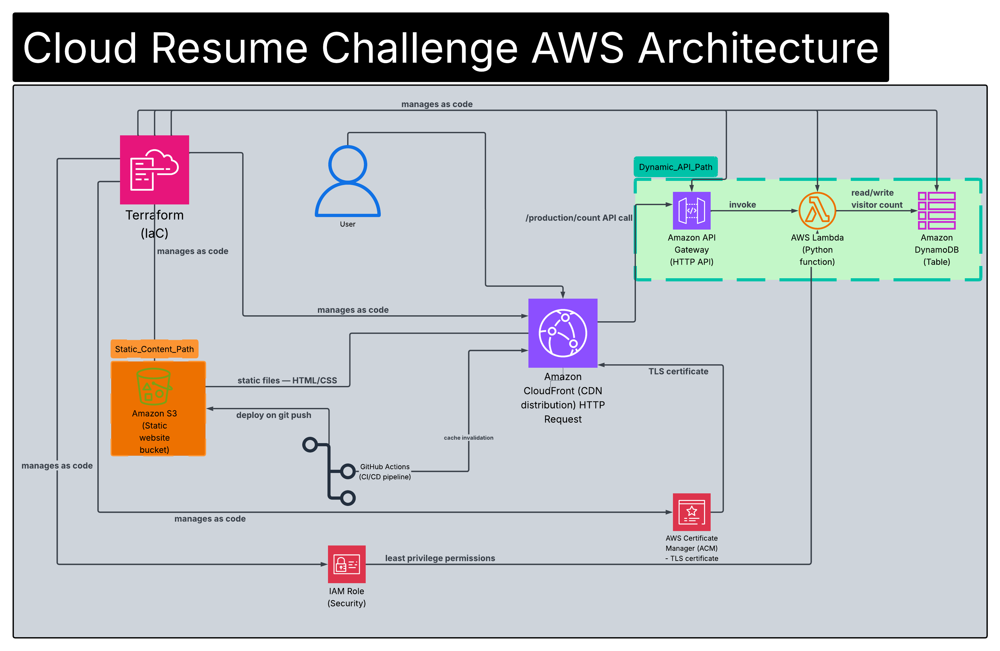

# Cloud Resume Challenge — AWS

**Live Site:** https://d19mfjmr0dtnqm.cloudfront.net
**GitHub:** https://github.com/RavjotD/cloud-resume-challenge-aws
**Blog Post:** https://dev.to/ravjotd/i-built-the-cloud-resume-challenge-on-aws-heres-everything-i-learned-ki6

---

## What This Is

A fully serverless, infrastructure-as-code resume hosted on AWS —
built as a hands-on companion to studying for the AWS Solutions
Architect Associate (SAA-C03).

Based on the [Cloud Resume Challenge](https://cloudresumechallenge.dev/docs/the-challenge/aws/)
by Forrest Brazeal. Every service used in this project maps directly
to an exam domain — deployed in a real environment, not just described
in a study guide.

**Total cost to run: $0/month** — all services operate within
AWS Free Tier limits.

---

## How It Works

When a user visits the live URL, here is what happens end to end:

1. The browser sends an HTTPS request to **CloudFront** — the CDN
   distribution serving as the entry point to the entire stack.

2. CloudFront checks its edge cache. If the HTML is cached, it
   returns it instantly from the nearest edge location. If not,
   it fetches from the **S3 origin bucket** and caches it for
   future requests.

3. The browser renders the resume. A JavaScript `fetch()` call
   fires automatically to the **API Gateway** endpoint.

4. API Gateway receives the request, validates CORS headers against
   the allowed origin (CloudFront domain), and triggers the
   **Lambda function**.

5. Lambda reads the current visitor count from **DynamoDB**,
   increments it by 1, writes the new value back, and returns
   the count as JSON.

6. The browser receives the response and updates the visitor
   counter displayed at the bottom of the resume — live, in real
   time, on every page load.

7. When code is pushed to the main branch, **GitHub Actions**
   automatically runs unit tests, uploads the updated HTML to S3,
   and invalidates the CloudFront cache — all without a single
   manual AWS command.

**Terraform** manages every AWS resource as code. Running
`terraform apply` from a clean account rebuilds the entire stack
in under 2 minutes.

---

## Architecture



### Static Content Path
```
User → CloudFront (HTTPS + ACM TLS) → S3 Bucket (HTML/CSS)
```

### Visitor Counter Path
```
User → CloudFront → API Gateway (HTTP API)
                         → Lambda (Python 3.12)
                              → DynamoDB (visitor count)
```

### Supporting Infrastructure
```
GitHub Actions — runs tests → deploys to S3 → invalidates CloudFront
Terraform      — manages all AWS resources as code
IAM Role       — least-privilege permissions for Lambda
```

---

## Tech Stack

| Layer | Service | Purpose |
|---|---|---|
| CDN | Amazon CloudFront | Global edge caching + HTTPS |
| TLS | AWS Certificate Manager | Free TLS certificate |
| Storage | Amazon S3 | Static website hosting |
| Compute | AWS Lambda (Python 3.12) | Serverless visitor counter |
| Database | Amazon DynamoDB | Persistent count storage |
| API | Amazon API Gateway (HTTP) | Public REST endpoint |
| Security | AWS IAM Role | Least-privilege Lambda access |
| IaC | Terraform | All infrastructure as code |
| CI/CD | GitHub Actions | Automated test + deploy pipeline |
| Testing | pytest + unittest.mock | Lambda unit tests |

---

## Project Structure
```
cloud-resume-challenge-aws/
├── website/
│   └── index.html              # Resume — deployed to S3
├── terraform/
│   ├── main.tf                 # All AWS infrastructure as code
│   └── variables.tf            # Configurable values
├── lambda/
│   ├── counter.py              # Visitor counter Lambda function
│   └── test_counter.py         # Unit tests (4 passing)
├── .github/
│   └── workflows/
│       └── deploy.yml          # CI/CD pipeline
├── architecture.png            # Architecture diagram
└── README.md
```

---

## CI/CD Pipeline

Every push to `main` triggers two sequential GitHub Actions jobs:
```
Push to main
    │
    ▼
[Job 1: Run Tests]
    • Set up Python 3.12
    • Install pytest + boto3
    • Run 4 Lambda unit tests
    • Must pass before deploy runs
    │
    ▼ (only if tests pass)
[Job 2: Deploy to AWS]
    • Configure AWS credentials
    • Upload index.html to S3
    • Invalidate CloudFront cache
    • Deployment confirmed
```

Average pipeline runtime: **under 60 seconds.**

---

## Unit Tests

Four tests covering the core Lambda function logic:

| Test | What It Verifies |
|---|---|
| `test_counter_increments` | Count increases by 1 on each invocation |
| `test_returns_correct_status_code` | Returns HTTP 200 |
| `test_cors_headers_present` | Access-Control-Allow-Origin header exists |
| `test_dynamodb_update_called` | DynamoDB write is called exactly once |

All tests use `unittest.mock` to mock the DynamoDB table —
no AWS credentials or live resources required to run them.

Run locally:
```bash
cd lambda
python -m pytest test_counter.py -v
```

---

## SOP — Deploy This Yourself

> **Prerequisites:** AWS account, AWS CLI configured,
> Terraform installed, Python 3.x, GitHub account

### Step 1 — Clone the repo
```bash
git clone https://github.com/RavjotD/cloud-resume-challenge-aws.git
cd cloud-resume-challenge-aws
```

### Step 2 — Configure AWS credentials
```bash
aws configure
```

| Prompt | Value |
|---|---|
| AWS Access Key ID | `[YOUR_ACCESS_KEY]` |
| AWS Secret Access Key | `[YOUR_SECRET_KEY]` |
| Default region | `[YOUR_REGION]` |
| Output format | `json` |

### Step 3 — Update variables
Edit `terraform/variables.tf` and set your bucket name and region.

### Step 4 — Deploy with Terraform
```bash
cd terraform
terraform init
terraform plan
terraform apply
```

### Step 5 — Upload resume
```bash
aws s3 cp website/index.html s3://[YOUR-BUCKET]/index.html
```

### Step 6 — Set up GitHub Actions secrets
Add these in **Settings → Secrets and variables → Actions:**

| Secret | Value |
|---|---|
| `AWS_ACCESS_KEY_ID` | IAM user access key |
| `AWS_SECRET_ACCESS_KEY` | IAM user secret key |
| `AWS_REGION` | Your AWS region |
| `S3_BUCKET` | Your bucket name |
| `CLOUDFRONT_DISTRIBUTION_ID` | Your distribution ID |

Every push to main now deploys automatically.

---

## What I Learned

**IaC changes how you think about infrastructure.**
Building everything manually first, then rewriting it all in
Terraform, made the value of infrastructure as code immediately
obvious. Drift detection, reproducibility, and the ability to
rebuild the entire stack in 2 minutes aren't abstract concepts
anymore — I've experienced them.

**The services click differently when you deploy them.**
I knew from studying that Lambda needs an IAM Role with a trust
policy. Knowing it and configuring it by hand are different things.
The same applies to CORS, CloudFront cache invalidation, DynamoDB
billing modes, and API Gateway integrations. Every service I
deployed reinforced 2–3 SAA-C03 concepts in a way that passive
study never did.

**CI/CD is not optional.**
After setting up GitHub Actions, going back to manual deployments
felt broken. Tests running automatically, deployments happening
on push, zero manual steps — this is the baseline, not a luxury.

**Debugging distributed systems requires method, not luck.**
The hardest bug in this project (the visitor counter not
displaying) required ruling out the JavaScript, the API, the
Lambda function, the DynamoDB table, and the CloudFront cache
before finding the actual cause. That structured elimination
process is the core skill of systems thinking.

---

## Challenges

**CORS debugging**
The visitor counter wasn't loading despite the API returning
correct data. Traced it through the browser console, curl verbose
headers, and direct Lambda invocations before discovering API
Gateway was stripping CORS headers. Fixed by explicitly configuring
the allowed origin on the API. Time spent: longer than expected.
Lesson learned: permanent.

**Two CloudFront distributions**
Created a second CloudFront distribution accidentally during
initial setup. Was invalidating the wrong distribution for
several attempts before listing all distributions from the CLI
and identifying the duplicate. Deleted the unused one.
Terraform would have prevented this entirely.

**Terraform state and existing resources**
Running `terraform apply` against infrastructure that was built
manually required importing every resource into state before
Terraform could manage it. Learned the difference between
`terraform import`, state management, and what happens when
state drifts from reality.

**Route conflict during Terraform apply**
Terraform tried to update an OPTIONS route thinking it was the
GET route because the wrong route ID was imported into state.
Fixed by removing the incorrect resource from state with
`terraform state rm` and reimporting the correct route ID.

---

## Progress Log

- **Week 1 — Mar 2026:** S3 static website live. HTML resume
  deployed. GitHub repo initialized.
- **Week 2 — Mar 2026:** CloudFront distribution deployed.
  HTTPS live. Cache invalidation tested.
- **Week 3 — Mar 2026:** DNS skipped — CloudFront URL used
  as live endpoint.
- **Week 4 — Mar 2026:** Lambda visitor counter deployed.
  DynamoDB table live. Function tested and incrementing.
- **Week 5 — Mar 2026:** API Gateway HTTP API deployed.
  Visitor counter live on resume page. CORS resolved.
- **Week 6 — Mar 2026:** Full infrastructure written in
  Terraform. All resources imported. terraform plan shows
  zero drift.
- **Week 7 — Mar 2026:** GitHub Actions CI/CD pipeline live.
  Tests gate every deployment. Zero manual steps remaining.
- **Week 8 — Mar 2026:** Unit tests written and passing.
  Architecture diagram added. Blog post published.
  AWS Cloud Resume Challenge complete.

---

## Author

**Ravjot Duhra**
Technical Infrastructure & Systems Engineer · Surrey, BC, Canada

[LinkedIn](https://www.linkedin.com/in/ravjot-duhra/) ·
[GitHub](https://github.com/RavjotD) ·
[Dev.to Post](https://dev.to/ravjotd/i-built-the-cloud-resume-challenge-on-aws-heres-everything-i-learned-ki6)

---

*Part of a multi-cloud portfolio — Azure version coming next.*
*Same project. Different cloud. One Terraform codebase.*